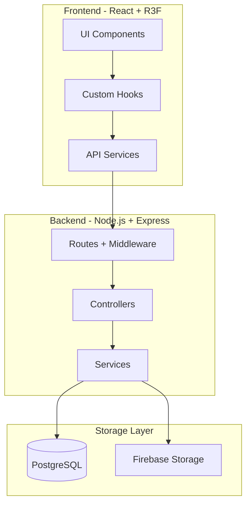
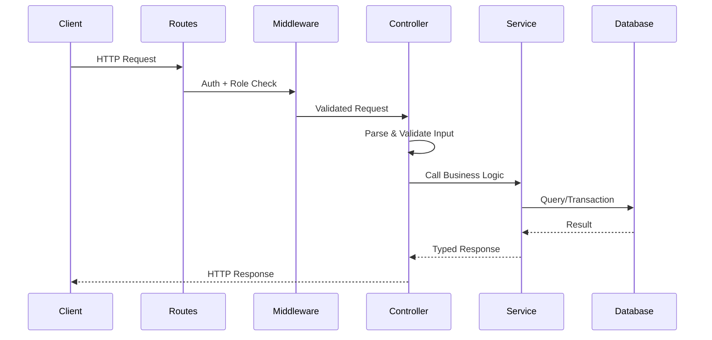
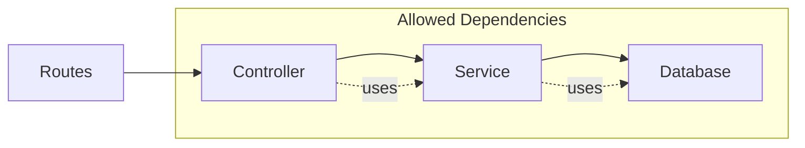
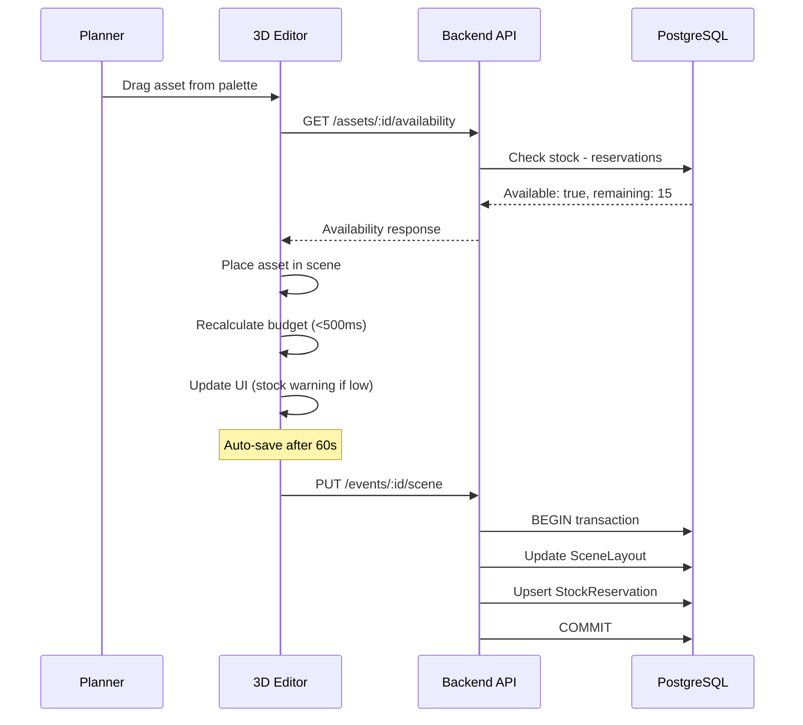
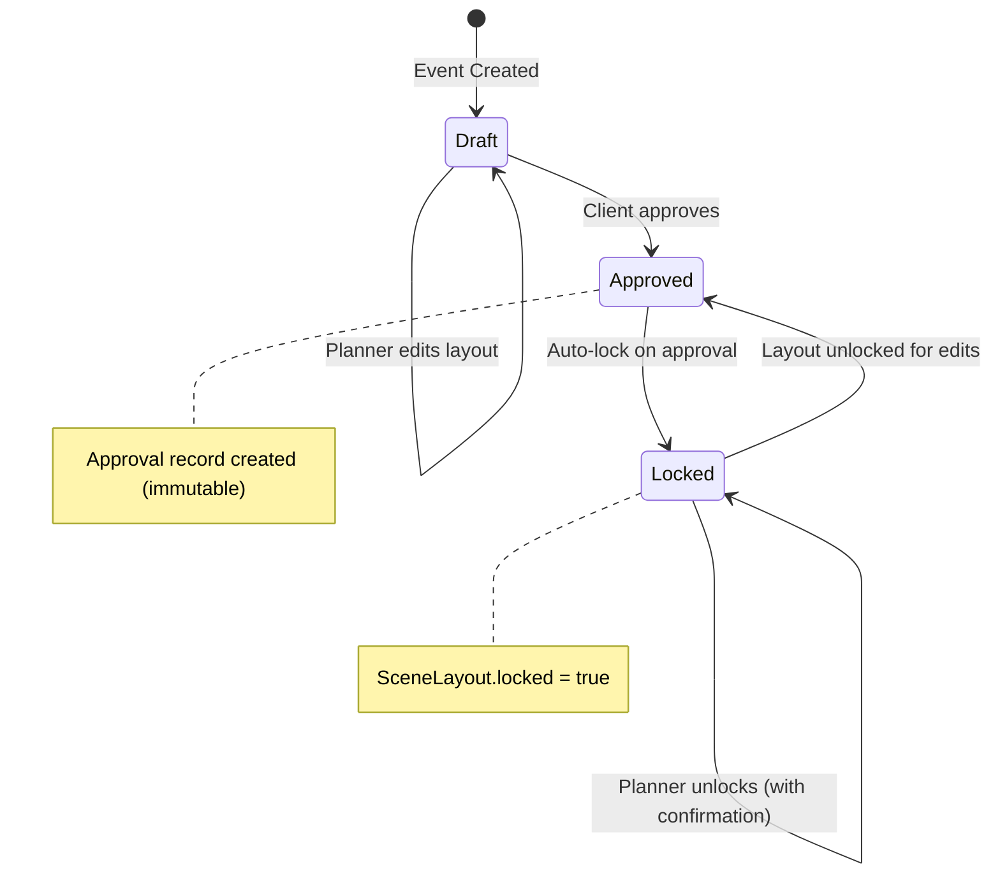

# DreamStage - Complete Implementation Plan

## Architecture Overview




### Backend Request Flow




## Project Structure (Feature-Based Modules)

```
dreamstage/
├── client/                      # React frontend
│   ├── src/
│   │   ├── components/          # Shared UI components (Button, Modal, etc.)
│   │   ├── features/            # Feature modules
│   │   │   ├── auth/            # Login, register, auth state
│   │   │   ├── dashboard/       # Event list, overview
│   │   │   ├── editor/          # 3D venue editor
│   │   │   ├── budget/          # Budget panel, vendor management
│   │   │   ├── collaboration/   # Comments, approval, shared view
│   │   │   └── admin/           # Admin panels (venues, assets, planners)
│   │   ├── hooks/               # Shared custom hooks
│   │   ├── services/            # API client (typed requests/responses)
│   │   ├── store/               # Global state (Zustand)
│   │   ├── types/               # Shared TypeScript types
│   │   ├── config/              # Constants, feature flags
│   │   └── utils/               # Pure utility functions (formatPKR, etc.)
│   └── package.json
├── server/                      # Node.js backend
│   ├── src/
│   │   ├── modules/             # Feature modules (Routes → Controller → Service)
│   │   │   ├── auth/
│   │   │   │   ├── auth.routes.ts
│   │   │   │   ├── auth.controller.ts
│   │   │   │   ├── auth.service.ts
│   │   │   │   └── auth.types.ts
│   │   │   ├── events/
│   │   │   │   ├── events.routes.ts
│   │   │   │   ├── events.controller.ts
│   │   │   │   ├── events.service.ts
│   │   │   │   └── events.types.ts
│   │   │   ├── editor/
│   │   │   ├── budget/
│   │   │   ├── inventory/
│   │   │   ├── booking/
│   │   │   └── collaboration/
│   │   ├── middleware/          # Auth, role validation, error handling
│   │   ├── db/                  # Database client, query helpers
│   │   ├── config/              # Constants, thresholds, state maps
│   │   └── utils/               # Shared utilities
│   └── package.json
├── database/
│   └── migrations/              # SQL migration files (numbered)
└── package.json                 # Root workspace config (npm workspaces)
```

---

## Architecture Rules (MUST FOLLOW)

### 1. Layered Backend Architecture




| Layer          | Responsibility                                  | Can Depend On    |
| -------------- | ----------------------------------------------- | ---------------- |
| **Routes**     | Define endpoints, attach middleware             | Controller       |
| **Controller** | Parse req/res, validate input, format response  | Service          |
| **Service**    | Business logic, state transitions, calculations | Database, Config |
| **Database**   | SQL queries, transactions                       | Nothing          |


**Strict Rules:**

- Controllers must NOT contain business logic
- Services must NOT import Express or touch req/res objects
- Services must NOT depend on other module's controllers
- No circular dependencies between modules

### 2. Module Structure

Each backend module contains only necessary files (keep minimal):

```
/modules/auth/
├── auth.routes.ts      # Express router, middleware attachment
├── auth.controller.ts  # HTTP handling only
├── auth.service.ts     # Business logic
└── auth.types.ts       # TypeScript interfaces (if needed)
```

Do NOT over-fragment. Combine related logic. Only split when a file exceeds ~300 lines.

### 3. Centralized Constants (No Hardcoding)

All magic values must live in config files:

```
/server/src/config/
├── constants.ts        # Roles, statuses, limits
├── thresholds.ts       # Stock warnings, budget percentages
├── stateTransitions.ts # Approval workflow state machine
└── checklistRules.ts   # Auto-generated checklist timing
```

**Example constants.ts:**

```ts
export const ROLES = {
  ADMIN: 'admin',
  PLANNER: 'planner',
} as const;

export const EVENT_STATUS = {
  DRAFT: 'draft',
  APPROVED: 'approved',
  LOCKED: 'locked',
} as const;

export const LIMITS = {
  MAX_PDF_SIZE_MB: 10,
  AUTO_SAVE_INTERVAL_MS: 60000,
  BCRYPT_COST_FACTOR: 12,
  JWT_EXPIRY_HOURS: 24,
} as const;
```

### 4. State Machine for Approval Workflow

Define explicit valid transitions:

```ts
// /server/src/config/stateTransitions.ts
export const EVENT_STATE_TRANSITIONS: Record<string, string[]> = {
  draft: ['approved'],      // Draft can only go to Approved
  approved: ['locked'],     // Approved auto-transitions to Locked
  locked: ['approved'],     // Locked can go back to Approved (unlock)
};

// Service validates before any transition
function canTransition(from: string, to: string): boolean {
  return EVENT_STATE_TRANSITIONS[from]?.includes(to) ?? false;
}
```

### 5. Database Transactions Required

The following operations MUST use transactions:

- Venue booking (check + insert atomically)
- Stock reservation (check + update atomically)
- Approval (update event + lock scene + create record atomically)

```ts
// Example pattern in service
async function createBooking(eventId: string, venueId: string, date: string) {
  return db.transaction(async (tx) => {
    // 1. Lock and check for conflicts
    const conflict = await tx.query(
      'SELECT id FROM venue_bookings WHERE venue_id = $1 AND date = $2 FOR UPDATE',
      [venueId, date]
    );
    if (conflict.rows.length > 0) {
      throw new ConflictError('Venue already booked for this date');
    }
    // 2. Insert booking
    return tx.query('INSERT INTO venue_bookings ...');
  });
}
```

### 6. Pure Functions for Calculations

Budget calculations must be pure (no side effects, no database calls):

```ts
// /server/src/modules/budget/budget.utils.ts (or client equivalent)

/** Calculate total cost for placed assets */
function calculateAssetCosts(
  placedAssets: PlacedAsset[],
  assetPrices: Map<string, number>,
  overrides: Map<string, number>
): number {
  return placedAssets.reduce((sum, asset) => {
    const price = overrides.get(asset.assetId) ?? assetPrices.get(asset.assetId) ?? 0;
    return sum + price;
  }, 0);
}
```

### 7. React Frontend Rules

```
/client/src/features/editor/
├── Editor.tsx              # Main component (orchestration only)
├── components/
│   ├── Canvas3D.tsx        # R3F canvas wrapper
│   ├── AssetPalette.tsx    # Sidebar asset list
│   ├── TransformGizmo.tsx  # Transform controls
│   └── BudgetPanel.tsx     # Budget display
├── hooks/
│   ├── useSceneState.ts    # Scene state management
│   ├── useBudgetCalc.ts    # Budget calculation hook
│   └── useAutoSave.ts      # Auto-save logic
└── utils/
    └── sceneSerializer.ts  # JSON serialization
```

**Rules:**

- Components render UI only, no business logic
- Hooks contain stateful logic and side effects
- Utils contain pure functions
- No component file > 200 lines (split if larger)

### 8. Type Safety

All service inputs/outputs must be typed:

```ts
// /server/src/modules/events/events.types.ts
export interface CreateEventInput {
  name: string;
  type: string;
  date: string;
  venueTemplateId: string;
  budgetCeiling: number;
}

export interface EventResponse {
  id: string;
  name: string;
  status: 'draft' | 'approved' | 'locked';
  budgetCeiling: number;
  createdAt: string;
}

// Service function signature
async function createEvent(
  plannerId: string, 
  input: CreateEventInput
): Promise<EventResponse>
```

### 9. Comment Standards

```ts
/**
 * Creates a new event for a planner.
 * Generates share token and initializes empty scene layout.
 */
async function createEvent(plannerId: string, input: CreateEventInput) {
  // Generate UUID v4 for share link (not sequential for security)
  const shareToken = uuid.v4();
  
  // ... implementation
}

// Only explain non-obvious "why", not obvious "what"
// BAD:  // Loop through assets
// GOOD: // Use Map for O(1) price lookups instead of repeated DB queries
```

### 10. Simplicity Rule

- Prefer simple, readable code over clever abstractions
- Don't create a base class/factory/pattern unless there are 3+ use cases
- If a function is < 20 lines, it probably doesn't need its own file
- Avoid premature optimization
- Code should be modifiable without major refactoring

---

## Design System

DreamStage uses a soft, warm, elegant aesthetic with full light/dark mode support.

### Typography


| Usage               | Font             | Weight  | Notes           |
| ------------------- | ---------------- | ------- | --------------- |
| Headings (h1-h3)    | Playfair Display | 600-700 | Serif, elegant  |
| Subheadings (h4-h6) | DM Sans          | 600     | Clean, modern   |
| Body text           | DM Sans          | 400     | 16px base       |
| UI elements         | DM Sans          | 500     | Buttons, labels |
| Numbers/Data        | DM Sans          | 500     | Tabular figures |


**Google Fonts import:**

```css
@import url('https://fonts.googleapis.com/css2?family=DM+Sans:wght@400;500;600;700&family=Playfair+Display:wght@600;700&display=swap');
```

### Color Palette (CSS Variables)

```css
/* client/src/styles/theme.css */

:root {
  /* Base colors */
  --background: #faf8f5;
  --surface: #ffffff;
  --text-primary: #2a2118;
  --text-muted: #7a6e62;
  
  /* Accent */
  --accent: #c9a6e4;
  --accent-hover: #b894d6;
  
  /* Module colors */
  --color-rose: #f9c5d1;      /* Editor */
  --color-lavender: #d4c5f9;  /* Budget */
  --color-mint: #b8f0e0;      /* Approval/Collaboration */
  --color-peach: #ffd6b3;     /* Inventory */
  --color-sky: #b3deff;       /* Booking */
  --color-lemon: #fef3a0;     /* Dashboard */
  
  /* Semantic */
  --success: #4ade80;
  --warning: #fbbf24;
  --error: #f87171;
  
  /* Shadows */
  --shadow-sm: 0 1px 2px rgba(42, 33, 24, 0.05);
  --shadow-md: 0 4px 12px rgba(42, 33, 24, 0.08);
  --shadow-lg: 0 8px 24px rgba(42, 33, 24, 0.12);
  
  /* Transitions */
  --transition-fast: 0.2s ease;
  --transition-base: 0.4s ease;
  
  /* Border radius */
  --radius-sm: 8px;
  --radius-md: 12px;
  --radius-lg: 16px;
  --radius-xl: 24px;
}

[data-theme="dark"] {
  --background: #16121e;
  --surface: #211c2e;
  --text-primary: #f0eaff;
  --text-muted: #9b92b8;
  
  --accent: #c9a6e4;
  --accent-hover: #d4b8eb;
  
  /* Module colors (slightly muted for dark mode) */
  --color-rose: #3d2832;
  --color-lavender: #2d2840;
  --color-mint: #1e3830;
  --color-peach: #3d3020;
  --color-sky: #1e2d3d;
  --color-lemon: #3d3820;
  
  --shadow-sm: 0 1px 2px rgba(0, 0, 0, 0.2);
  --shadow-md: 0 4px 12px rgba(0, 0, 0, 0.3);
  --shadow-lg: 0 8px 24px rgba(0, 0, 0, 0.4);
}
```

### Module Color Coding

Each feature module has an assigned color for visual consistency:


| Module        | Color    | Variable           | Usage                            |
| ------------- | -------- | ------------------ | -------------------------------- |
| 3D Editor     | Rose     | `--color-rose`     | Editor cards, icons, accents     |
| Budget        | Lavender | `--color-lavender` | Budget panels, vendor cards      |
| Collaboration | Mint     | `--color-mint`     | Comments, approval status        |
| Inventory     | Peach    | `--color-peach`    | Stock indicators, asset cards    |
| Booking       | Sky      | `--color-sky`      | Venue cards, calendar highlights |
| Dashboard     | Lemon    | `--color-lemon`    | Event cards, overview stats      |


### Component Styling Standards

**Cards:**

```css
.card {
  background: var(--surface);
  border-radius: var(--radius-lg);
  box-shadow: var(--shadow-md);
  padding: 1.5rem;
  transition: box-shadow var(--transition-base);
}

.card:hover {
  box-shadow: var(--shadow-lg);
}

/* Module-specific card accent */
.card--editor { border-left: 4px solid var(--color-rose); }
.card--budget { border-left: 4px solid var(--color-lavender); }
.card--collaboration { border-left: 4px solid var(--color-mint); }
```

**Buttons:**

```css
.btn-primary {
  background: var(--accent);
  color: var(--background);
  border-radius: var(--radius-md);
  font-family: 'DM Sans', sans-serif;
  font-weight: 500;
  padding: 0.75rem 1.5rem;
  transition: all var(--transition-fast);
}

.btn-primary:hover {
  background: var(--accent-hover);
  transform: translateY(-1px);
}
```

**Navbar:**

```css
.navbar {
  background: rgba(250, 248, 245, 0.8);
  backdrop-filter: blur(12px);
  border-bottom: 1px solid rgba(42, 33, 24, 0.08);
}

[data-theme="dark"] .navbar {
  background: rgba(22, 18, 30, 0.8);
  border-bottom: 1px solid rgba(240, 234, 255, 0.08);
}
```

### Tailwind Configuration

```js
// client/tailwind.config.js
module.exports = {
  darkMode: ['class', '[data-theme="dark"]'],
  theme: {
    extend: {
      colors: {
        background: 'var(--background)',
        surface: 'var(--surface)',
        accent: 'var(--accent)',
        'text-primary': 'var(--text-primary)',
        'text-muted': 'var(--text-muted)',
        rose: 'var(--color-rose)',
        lavender: 'var(--color-lavender)',
        mint: 'var(--color-mint)',
        peach: 'var(--color-peach)',
        sky: 'var(--color-sky)',
        lemon: 'var(--color-lemon)',
      },
      fontFamily: {
        heading: ['Playfair Display', 'serif'],
        sans: ['DM Sans', 'sans-serif'],
      },
      borderRadius: {
        DEFAULT: 'var(--radius-md)',
        lg: 'var(--radius-lg)',
        xl: 'var(--radius-xl)',
      },
      boxShadow: {
        sm: 'var(--shadow-sm)',
        DEFAULT: 'var(--shadow-md)',
        lg: 'var(--shadow-lg)',
      },
      transitionDuration: {
        DEFAULT: '400ms',
      },
    },
  },
};
```

### Page-Specific Styling


| Page               | Primary Module Color | Key Visual Elements                            |
| ------------------ | -------------------- | ---------------------------------------------- |
| Dashboard          | Lemon                | Event cards with status badges, progress rings |
| 3D Editor          | Rose                 | Asset palette sidebar, canvas container        |
| Budget             | Lavender             | Budget panel, vendor cards, payment timeline   |
| Vendors            | Lavender             | Vendor list cards, payment status indicators   |
| Checklist          | Lemon                | Task cards with checkboxes, due date badges    |
| Admin - Venues     | Sky                  | Venue gallery cards, availability calendar     |
| Admin - Assets     | Peach                | Inventory table, stock level bars              |
| Admin - Planners   | Neutral              | User table with status toggles                 |
| Client Shared View | Mint                 | Read-only 3D viewer, approval button           |


### Theme Toggle Implementation

```tsx
// client/src/hooks/useTheme.ts
function useTheme() {
  const [theme, setTheme] = useState<'light' | 'dark'>(() => {
    return localStorage.getItem('theme') as 'light' | 'dark' || 'light';
  });

  useEffect(() => {
    document.documentElement.setAttribute('data-theme', theme);
    localStorage.setItem('theme', theme);
  }, [theme]);

  const toggle = () => setTheme(t => t === 'light' ? 'dark' : 'light');

  return { theme, toggle };
}
```

### Design Tokens Summary

```
Typography:
  heading: Playfair Display (600/700)
  body: DM Sans (400/500/600)

Colors:
  background: #faf8f5 / #16121e
  surface: #ffffff / #211c2e
  accent: #c9a6e4
  modules: rose, lavender, mint, peach, sky, lemon

Spacing:
  base: 4px grid (0.25rem increments)
  card-padding: 1.5rem
  section-gap: 2rem

Radius:
  sm: 8px, md: 12px, lg: 16px, xl: 24px

Shadows:
  sm/md/lg with warm undertones (light) or deep blacks (dark)

Transitions:
  fast: 0.2s (hover states)
  base: 0.4s (theme changes, page transitions)
```

---

## Currency: Pakistani Rupees (PKR)

All monetary values in DreamStage are displayed and stored in **Pakistani Rupees (PKR)**.

### Currency Rules

- **Database Storage:** All price/amount columns store values in PKR as `DECIMAL(12,2)` (supports up to 9,999,999,999.99 PKR)
- **Display Format:** Use `Rs.` prefix or `₨` symbol (e.g., `Rs. 25,000` or `₨25,000`)
- **Thousands Separator:** Use comma grouping (e.g., `Rs. 1,500,000` for 15 lakh)
- **No Decimals in UI:** Display whole rupees only (round to nearest rupee) unless paisa precision needed

### Frontend Formatting Utility

```ts
// client/src/utils/currency.ts
export function formatPKR(amount: number): string {
  return `Rs. ${amount.toLocaleString('en-PK', { 
    maximumFractionDigits: 0 
  })}`;
}

// Examples:
// formatPKR(25000)     → "Rs. 25,000"
// formatPKR(1500000)   → "Rs. 15,00,000" (lakh format)
// formatPKR(150000000) → "Rs. 15,00,00,000" (crore format)
```

### Where PKR is Used


| Location             | Example Display           |
| -------------------- | ------------------------- |
| Asset default price  | Rs. 2,500                 |
| Budget ceiling input | Rs. 500,000               |
| Budget summary panel | Total: Rs. 350,000        |
| Vendor payment form  | Amount: Rs. 50,000        |
| Line item in budget  | Chairs (40×) - Rs. 80,000 |


---

## Phase 1: Project Foundation

### 1.1 Initialize Monorepo

- Create root `package.json` with npm workspaces
- Initialize `client/` with Vite + React + TypeScript
- Initialize `server/` with Express + TypeScript
- Configure ESLint, Prettier for both

### 1.2 Database Schema

Create PostgreSQL migrations for all 15 tables:

```sql
-- Core tables with relationships (all prices in PKR)
User (id UUID PK, name, email UNIQUE, password_hash, role ENUM, created_at)
VenueTemplate (id UUID PK, name, category, capacity INT, thumbnail_url, model_ref, is_active BOOL)
Asset (id UUID PK, name, category, default_unit_price DECIMAL(12,2), stock_quantity INT, model_ref, is_active)
  -- default_unit_price: PKR amount (e.g., 2500.00 = Rs. 2,500)
Event (id UUID PK, planner_id FK→User, venue_template_id FK, name, type, date, status ENUM, share_token UUID UNIQUE, share_password_hash, budget_ceiling DECIMAL(12,2))
  -- budget_ceiling: PKR amount (e.g., 500000.00 = Rs. 5,00,000)
SceneLayout (id UUID PK, event_id FK→Event UNIQUE, scene_json JSONB, version INT, locked BOOL, timestamps)
BudgetItem (id UUID PK, event_id FK, asset_id FK, quantity INT, unit_price_override DECIMAL(12,2), vendor_id FK)
  -- unit_price_override: PKR amount, NULL uses Asset.default_unit_price
VendorPayment (id UUID PK, vendor_id FK, amount DECIMAL(12,2), type ENUM, paid_at)
  -- amount: PKR payment amount (e.g., 50000.00 = Rs. 50,000)
-- ... remaining tables as per spec
```

Key indexes: `Event.planner_id`, `Event.share_token`, `VenueBooking(venue_template_id, date)`, `StockReservation(event_id, asset_id)`

### 1.3 Authentication System

- `POST /api/auth/register` - Planner registration (bcrypt cost 12)
- `POST /api/auth/login` - Returns JWT (24h expiry)
- `GET /api/auth/me` - Validate token, return user
- JWT middleware: Extract token → verify → attach `req.user`
- Role middleware factory: `requireRole('admin')`, `requireRole('planner')`

### 1.4 Base API Structure

- Express app with JSON body parser, CORS, helmet
- Error handling middleware with structured responses
- Request validation using Zod schemas

---

## Phase 2: Admin Module (Foundation for Asset/Venue Management)

### 2.1 Venue Template Management

- `GET /api/admin/venues` - List all templates (paginated)
- `POST /api/admin/venues` - Create template
- `PUT /api/admin/venues/:id` - Update template
- `PATCH /api/admin/venues/:id/toggle` - Toggle is_active

Admin UI: Table view with add/edit modal, thumbnail preview

### 2.2 Asset/Décor Inventory Management

- `GET /api/admin/assets` - List with category filter
- `POST /api/admin/assets` - Create asset (name, category, price in PKR, stock, model_ref placeholder)
- `PUT /api/admin/assets/:id` - Update asset
- `PATCH /api/admin/assets/:id/stock` - Adjust stock quantity

Admin UI: Inventory table with stock badges, category tabs, prices displayed as "Rs. X,XXX"

Example default prices (PKR):

- Round Table: Rs. 3,000
- Chair: Rs. 500
- Centerpiece: Rs. 1,500
- LED Light String: Rs. 800
- Stage Platform (per sq ft): Rs. 150

### 2.3 Planner Account Management

- `GET /api/admin/planners` - List all planners
- `PATCH /api/admin/planners/:id/status` - Activate/deactivate

---

## Phase 3: 3D Venue Editor (Module A) - Core Feature

### 3.1 React Three Fiber Scene Setup

```tsx
// Core scene structure
<Canvas>
  <PerspectiveCamera />
  <OrbitControls />        // Orbit mode
  <PointerLockControls />  // Walkthrough mode (toggle)
  <ambientLight />
  <directionalLight />
  <VenueModel />           // Loaded venue template
  <PlacedAssets />         // Dynamic asset instances
  <TransformControls />    // Gizmo for selected asset
</Canvas>
```

### 3.2 Placeholder 3D Primitives

Since actual .glb models come later, create primitive mappings:

```ts
const PRIMITIVE_MAP = {
  'chair': { geometry: 'box', scale: [0.5, 1, 0.5], color: '#8B4513' },
  'table': { geometry: 'box', scale: [1.5, 0.8, 1], color: '#654321' },
  'light': { geometry: 'sphere', scale: [0.3, 0.3, 0.3], color: '#FFD700' },
  // ... extensible for each asset category
};
```

When `model_ref` points to a `.glb`, use `useGLTF` loader; otherwise fall back to primitive.

### 3.3 Drag-and-Drop Asset Placement

- Asset palette sidebar (categorized list from API)
- Drag from palette → raycast to floor plane → place asset
- Each placed asset gets unique UUID, stored in scene state

### 3.4 Transform Controls

- Click asset to select → show TransformControls gizmo
- Mode toggle: Translate / Rotate / Scale
- Real-time position/rotation/scale updates to local state

### 3.5 Scene Serialization & Auto-Save

Scene JSON structure:

```json
{
  "version": 1,
  "venueTemplateId": "uuid",
  "assets": [
    { "instanceId": "uuid", "assetId": "uuid", "position": [x,y,z], "rotation": [x,y,z], "scale": [x,y,z] }
  ],
  "lighting": { "ambient": 0.5, "directional": { "intensity": 1, "position": [10,10,10] } }
}
```

- Auto-save every 60 seconds via `setInterval` → `PUT /api/events/:id/scene`
- Increment version on each save
- API validates event ownership, checks `locked` status

### 3.6 Lock/Unlock Mechanism

- When `SceneLayout.locked = true`, editor enters read-only mode
- Planner unlock: `PATCH /api/events/:id/unlock` with confirmation body
- UI: Lock icon indicator, confirmation modal for unlock

---

## Phase 4: Budget & Cost Estimation Engine (Module B)

### 4.1 Live Budget Calculation (PKR)

On every asset add/remove/quantity change:

```ts
function calculateBudget(sceneAssets, assetPrices, budgetItems) {
  // All values in PKR
  const assetCosts = sceneAssets.reduce((sum, a) => 
    sum + (budgetItems[a.assetId]?.unit_price_override ?? assetPrices[a.assetId]), 0);
  const vendorCosts = vendors.reduce((sum, v) => sum + v.totalPayments, 0);
  return { assetCosts, vendorCosts, total: assetCosts + vendorCosts };
}

// Display in UI using formatPKR():
// Budget Ceiling: Rs. 5,00,000
// Asset Costs:    Rs. 3,50,000
// Vendor Costs:   Rs. 1,20,000
// Total:          Rs. 4,70,000
// Remaining:      Rs. 30,000
```

Recalculation target: <500ms (compute in frontend, sync to backend)

### 4.2 Budget APIs

- `GET /api/events/:id/budget` - Get budget summary + line items (all amounts in PKR)
- `PUT /api/events/:id/budget-ceiling` - Set ceiling in PKR (e.g., `{ ceiling: 500000 }` for Rs. 5,00,000)
- `POST /api/events/:id/budget-items` - Add/override line item with PKR price
- `DELETE /api/events/:id/budget-items/:itemId` - Remove override

### 4.3 Vendor Management

- `GET /api/events/:id/vendors` - List vendors for event
- `POST /api/events/:id/vendors` - Add vendor
- `PUT /api/events/:id/vendors/:vendorId` - Update vendor
- `DELETE /api/events/:id/vendors/:vendorId` - Remove vendor

### 4.4 Vendor Payments (PKR)

- `POST /api/vendors/:id/payments` - Log payment (deposit/final), amount in PKR
- `GET /api/vendors/:id/payments` - Payment history

Example vendor payment display:

```
Karachi Catering Co.
├─ Deposit:  Rs. 50,000  (Feb 10)
├─ Final:    Rs. 1,50,000 (Mar 10)
└─ Total:    Rs. 2,00,000
```

### 4.5 PDF Quote Upload (Firebase Storage)

- `POST /api/vendors/:id/quote` - Upload PDF (max 10MB, MIME validation)
- Server: Validate file → upload to Firebase → store signed URL in Vendor.quote_url
- Frontend: Dropzone component with progress indicator

---

## Phase 5: Décor & Asset Inventory (Module E)

### 5.1 Stock Validation on Asset Placement

When planner places asset in editor:

1. Frontend sends `GET /api/assets/:id/availability?eventId=X&quantity=Y`
2. Backend calculates: `stock_quantity - SUM(reservations for other events on same date)`
3. Returns `{ available: boolean, remaining: number }`
4. Target: <300ms response

### 5.2 Stock Reservation

- On scene save, calculate delta of assets
- `POST /api/events/:id/reservations` - Batch upsert reservations
- Uses DB transaction to prevent race conditions:

```sql
BEGIN;
SELECT ... FOR UPDATE;  -- Lock rows
-- Validate availability
INSERT/UPDATE StockReservation;
COMMIT;
```

### 5.3 Stock Warnings UI

- Yellow warning badge when stock low (<5 remaining)
- Red error when attempting to exceed available stock
- Real-time updates without page reload (poll or optimistic)

---

## Phase 6: Venue Inventory & Booking (Module D)

### 6.1 Venue Selection with Conflict Check

- `GET /api/venues?date=YYYY-MM-DD` - Returns venues with availability status
- Backend checks VenueBooking table for conflicts

### 6.2 Booking Creation

- `POST /api/events/:id/booking` - Create provisional booking
- Uses DB transaction:

```sql
BEGIN;
SELECT id FROM VenueBooking WHERE venue_template_id = $1 AND date = $2 FOR UPDATE;
-- If exists, ROLLBACK with conflict error
INSERT INTO VenueBooking (...) VALUES (...);
COMMIT;
```

### 6.3 Booking Confirmation

- `PATCH /api/bookings/:id/confirm` - Move from provisional → confirmed
- Only planner who owns event can confirm

### 6.4 Admin Conflict Resolution

- `GET /api/admin/bookings/conflicts` - List conflicting bookings
- `DELETE /api/admin/bookings/:id` - Admin can remove booking

---

## Phase 7: Client Collaboration & Approval (Module C)

### 7.1 Share Link Generation

- On event creation, generate `share_token` (UUID v4)
- `PATCH /api/events/:id/share` - Set/update share password (optional)
- Share URL: `https://app.com/view/{share_token}`

### 7.2 Client Access (No Auth Required)

- `GET /api/shared/:token` - Validate token, optional password check
- Returns: Event details, scene JSON, budget summary (if planner allows)
- No JWT required; token is the auth mechanism

### 7.3 Read-Only 3D View

- Same React Three Fiber scene but:
  - No TransformControls
  - No asset palette
  - Orbit + walkthrough modes available
- Mobile-responsive canvas

### 7.4 Client Comments

- `GET /api/shared/:token/comments` - List comments (threaded via parent_comment_id)
- `POST /api/shared/:token/comments` - Add comment (client_identifier from form)
- Planner views/responds in their dashboard

### 7.5 Approval Workflow

State machine: `Draft → Approved → Locked`

- `POST /api/shared/:token/approve` - Client submits approval
- Backend:
  1. Validate event status is 'Draft'
  2. Create immutable Approval record
  3. Update Event.status to 'Approved'
  4. Set SceneLayout.locked = true
- Approval record is write-once (no UPDATE/DELETE endpoints)

### 7.6 Planner Unlock

- `PATCH /api/events/:id/unlock` - Requires confirmation body
- Sets SceneLayout.locked = false
- Event status remains 'Approved' (does not revert to Draft)

---

## Phase 8: Multi-Event Dashboard (Module F)

### 8.1 Dashboard Overview

- `GET /api/events` - Planner's events with status, date, venue
- Cards showing: Event name, date, status badge, budget vs ceiling (in PKR), days remaining

Example card display:

```
┌─────────────────────────────┐
│ Ahmed Wedding               │
│ March 15, 2026 | 21 days    │
│ Status: Draft               │
│ Budget: Rs. 4,70,000 / Rs. 5,00,000  │
│ [████████░░] 94%            │
└─────────────────────────────┘
```

### 8.2 Checklist System

- `GET /api/events/:id/checklist` - Get items (custom + system-generated)
- `POST /api/events/:id/checklist` - Add custom item
- `PATCH /api/checklist/:id` - Toggle complete, update due_date
- `DELETE /api/checklist/:id` - Remove custom item (not system-generated)

System-generated items based on days remaining:

- 30 days: "Confirm venue booking"
- 14 days: "Finalize vendor payments"
- 7 days: "Review final layout with client"
- 1 day: "Confirm day-of timeline"

### 8.3 Milestones

- `GET /api/events/:id/milestones`
- `POST /api/events/:id/milestones` - Create milestone
- `PATCH /api/milestones/:id` - Update/complete
- `DELETE /api/milestones/:id`

### 8.4 Day-of Timeline

- `GET /api/events/:id/timeline` - Ordered timeline entries
- `POST /api/events/:id/timeline` - Add entry (time_slot, title, description)
- `PUT /api/timeline/:id` - Update entry
- `DELETE /api/timeline/:id`
- `PATCH /api/events/:id/timeline/reorder` - Reorder entries (sort_order)

---

## Phase 9: Frontend UI/UX

Apply the Design System defined above consistently across all pages.

### 9.1 Setup Design System Files

Create these files first:

- `client/src/styles/theme.css` - CSS variables for colors, typography, shadows
- `client/tailwind.config.js` - Tailwind theme extension
- `client/src/hooks/useTheme.ts` - Theme toggle hook
- `client/src/components/ThemeToggle.tsx` - Light/dark mode button

### 9.2 Layout Structure

```
┌─────────────────────────────────────────────────────────────────┐
│ Navbar (backdrop blur): Logo | Events | Admin? | Theme | Avatar│
├─────────────────────────────────────────────────────────────────┤
│                                                                 │
│  Route-based content area                                       │
│  (background: var(--background))                                │
│                                                                 │
└─────────────────────────────────────────────────────────────────┘
```

### 9.3 Key Pages with Module Colors


| Route                   | Page                  | Module Color    |
| ----------------------- | --------------------- | --------------- |
| `/login`, `/register`   | Auth                  | Accent (purple) |
| `/dashboard`            | Event list            | Lemon           |
| `/events/:id`           | Event detail tabs     | Mixed by tab    |
| `/events/:id/editor`    | Full-screen 3D editor | Rose            |
| `/events/:id/budget`    | Budget panel          | Lavender        |
| `/events/:id/vendors`   | Vendor management     | Lavender        |
| `/events/:id/checklist` | Checklist             | Lemon           |
| `/events/:id/timeline`  | Day-of timeline       | Lemon           |
| `/view/:token`          | Client shared view    | Mint            |
| `/admin/venues`         | Venue management      | Sky             |
| `/admin/assets`         | Asset inventory       | Peach           |
| `/admin/planners`       | Planner accounts      | Neutral         |


### 9.4 Component Library

Customize shadcn/ui components to match design system:

- **Buttons**: Use `--accent` for primary, rounded corners (`--radius-md`)
- **Cards**: Surface background, soft shadows, module color left border
- **Inputs**: Rounded, subtle border, focus ring with accent
- **Modals**: Backdrop blur, centered, rounded corners
- **Toasts**: Position bottom-right, slide-in animation
- **Tabs**: Underline style, accent color indicator
- **Tables**: Alternating row colors, hover highlight

### 9.5 Typography Application

```css
h1, h2, h3 { font-family: 'Playfair Display', serif; }
h4, h5, h6, body, button, input { font-family: 'DM Sans', sans-serif; }
```

### 9.6 Responsive Breakpoints


| Breakpoint | Width      | Layout Changes                               |
| ---------- | ---------- | -------------------------------------------- |
| Mobile     | < 640px    | Single column, bottom nav, collapsed sidebar |
| Tablet     | 640-1024px | Two columns, collapsible sidebar             |
| Desktop    | > 1024px   | Full layout, persistent sidebar              |


### 9.7 Animation Standards

- **Page transitions**: Fade in (0.4s)
- **Card hover**: Subtle lift with shadow increase
- **Theme switch**: Smooth color transitions (0.4s)
- **3D Editor**: 60fps minimum, no UI animation blocking render

---

## Phase 10: Deployment

### 10.1 Database (Render PostgreSQL)

- Create Render PostgreSQL instance
- Run migrations via connection string
- Set up connection pooling

### 10.2 Backend (Render Web Service)

- Deploy `server/` to Render
- Environment variables: `DATABASE_URL`, `JWT_SECRET`, `FIREBASE_`*
- Health check endpoint: `GET /api/health`

### 10.3 Frontend (Vercel)

- Deploy `client/` to Vercel
- Environment variable: `VITE_API_URL` pointing to Render backend
- Configure rewrites for SPA routing

### 10.4 Firebase Storage

- Create Firebase project
- Configure storage bucket
- Add Firebase credentials to backend env

---

## Data Flow Diagrams

### Asset Placement Flow




### Client Approval Flow




---

## Key Implementation Files

### Backend (Feature Modules)


| Purpose              | Path                                                  |
| -------------------- | ----------------------------------------------------- |
| Express app entry    | `server/src/index.ts`                                 |
| Auth routes          | `server/src/modules/auth/auth.routes.ts`              |
| Auth controller      | `server/src/modules/auth/auth.controller.ts`          |
| Auth service         | `server/src/modules/auth/auth.service.ts`             |
| Events module        | `server/src/modules/events/events.*.ts`               |
| Editor module        | `server/src/modules/editor/editor.*.ts`               |
| Budget module        | `server/src/modules/budget/budget.*.ts`               |
| Inventory module     | `server/src/modules/inventory/inventory.*.ts`         |
| Booking module       | `server/src/modules/booking/booking.*.ts`             |
| Collaboration module | `server/src/modules/collaboration/collaboration.*.ts` |
| Auth middleware      | `server/src/middleware/auth.ts`                       |
| Role middleware      | `server/src/middleware/requireRole.ts`                |
| DB client            | `server/src/db/client.ts`                             |
| Constants            | `server/src/config/constants.ts`                      |
| State transitions    | `server/src/config/stateTransitions.ts`               |
| DB migrations        | `database/migrations/*.sql`                           |


### Frontend (Feature Modules)


| Purpose                 | Path                                                |
| ----------------------- | --------------------------------------------------- |
| React app entry         | `client/src/main.tsx`                               |
| API client              | `client/src/services/api.ts`                        |
| Auth feature            | `client/src/features/auth/*.tsx`                    |
| Dashboard feature       | `client/src/features/dashboard/*.tsx`               |
| 3D Editor component     | `client/src/features/editor/Editor.tsx`             |
| Scene state hook        | `client/src/features/editor/hooks/useSceneState.ts` |
| Budget calculation hook | `client/src/features/budget/hooks/useBudgetCalc.ts` |
| Shared view page        | `client/src/features/collaboration/SharedView.tsx`  |
| PKR formatter           | `client/src/utils/currency.ts`                      |
| Shared types            | `client/src/types/*.ts`                             |
| Constants               | `client/src/config/constants.ts`                    |


---

## Estimated Complexity by Phase

- Phase 1 (Foundation): Setup and boilerplate - straightforward
- Phase 2 (Admin): Basic CRUD - straightforward
- Phase 3 (3D Editor): **Highest complexity** - React Three Fiber scene management, serialization
- Phase 4 (Budget): Medium - calculations and Firebase integration
- Phase 5 (Stock): Medium - transaction logic
- Phase 6 (Venue): Medium - conflict detection
- Phase 7 (Client): Medium-high - state machine, immutable records
- Phase 8 (Dashboard): Straightforward - CRUD with computed fields
- Phase 9 (UI): Medium - polish and responsiveness
- Phase 10 (Deploy): Straightforward - standard PaaS deployment

